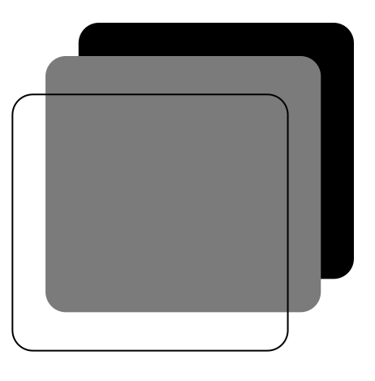
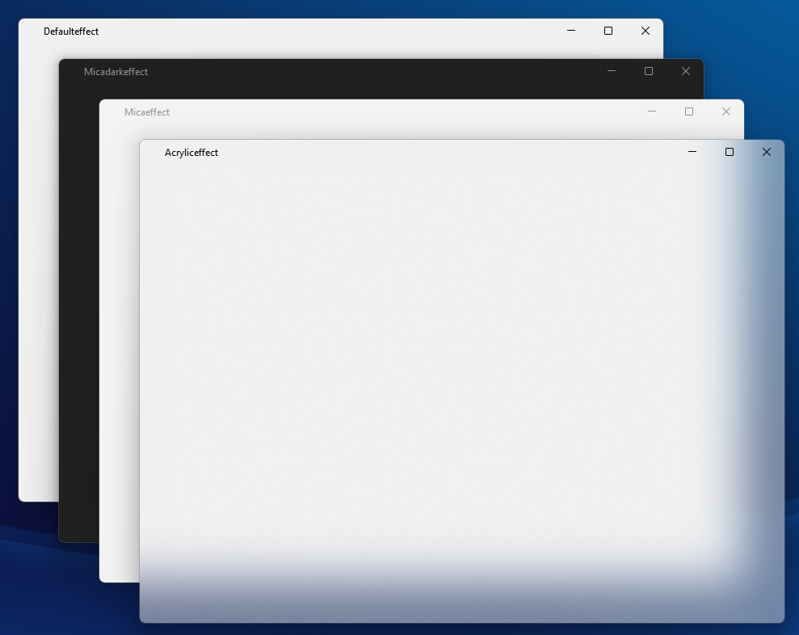
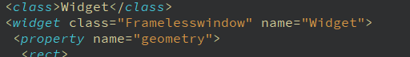
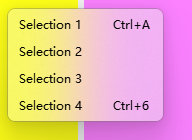

<div align="center">
  
  
  <h1>ErosUi</h1>

</div>

 <div align="center">

   

 </div>

> A Qt Custom Frameless Window Component for Windows 10/11


## Introduction

This project provides a good custom frameless window solution for Qt applications, fully supporting all standard window behaviors on Windows. 


The component includes:

- A built-in Windows 11 style title bar implementation.
- Three window styles:
  1. Default style
  2. Acrylic style **(not recommend)**
  3. Mica style (with automatic adaptation to the system's light/dark mode settings)
   
   
- APIs for for further customization。

This component can be seamlessly integrated into any Qt project by modifying the base class in the **.ui** XML files through Qt Creator.

## Dependencies
- Qt 5.10 or later (My environment is Qt 5.15)
- Windows 10/11 (for Win32 API features)
## Integration Guide 
- Clone the project.
  ```shell
  git clone https://github.com/Fan-7SZ/ErosUi.git
  ```
- Copy **framelesswindow** folder into your project root folder.
- Add following code in **.pro** file.

    ``` qmake
    include($$PWD/framelesswindow/framelesswindow.pri)
    ```
  
- Run qmake or built.
- Replace **"QWidget"** tag with **"Framelesswindow"** in the **.ui** file. Since "prompt to" selection is unavailable for QWidget component if it is main window in the designer.
  
  
  
- Modify the inheritance relationship in the declaration and implementation of the class, changing the inheritance from `QWidget` to `Framelesswindow`.
- Add the following code in the class constructor function to set Window effect.

  ```cpp
  setEffect(EWinStyle :: Defaulteffect);  // enable Default effect
  //setEffect(EWinStyle :: Acryliceffect); // enable Acrylic effect (not recommend)
  //setEffect(EWinStyle :: Micaeffect);  // enable Mica effect
  //setEffect(WindowEffect *c);  //enable your custom window effect
  ```

- Add the following code in **main.cpp** file to enable high dpi support in Qt.

  ``` cpp
  QApplication::setHighDpiScaleFactorRoundingPolicy(Qt::HighDpiScaleFactorRoundingPolicy::PassThrough);
  QApplication::setAttribute(Qt::AA_EnableHighDpiScaling);
  QApplication::setAttribute(Qt::AA_UseHighDpiPixmaps);
  ```

- Ensure leaving enough space for other components. If your use the built-in titlebar, the height is **32px**.
## Document

See more information at [here](./USAGE.md).

## Future Plan

- Support **Qt6**. 
  
  Due to some API change, these code can't work on Qt6, I think it's not a hard work.
- More Components. 
  
  This project was originally extracted from the development of a previous music player application (currently on hold due to challenges with audio decoding and other multi-threading development issues).
  It also includes implementations of several other Windows 11-style components. In the future, I plan to incorporate these additional components into this project someday.

  

- Support **Keyboard Shortcuts**.

- Support Cmake build.

## Reference
https://learn.microsoft.com/zh-cn/windows/apps/design/

https://blog.csdn.net/WPwalter/article/details/103268596

https://blog.csdn.net/liulianglin/article/details/14449577

https://www.cnblogs.com/zhiyiYo/p/14659981.html


